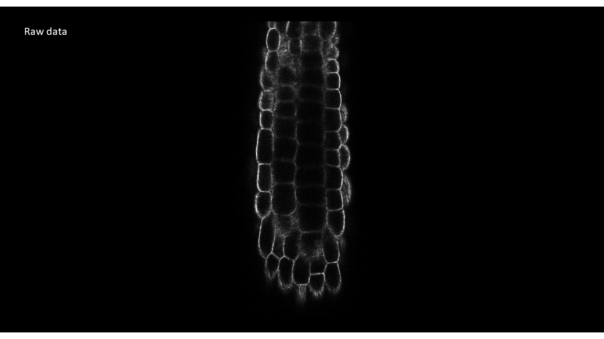

***************************
Surfcut for Python & Matlab
***************************

Surfcut for Python & Matlab is based on Surfcut for ImageJ 

Erguvan, O., Louveaux, M., Hamant, O., Verger, S. (2019) ImageJ SurfCut: a user-friendly pipeline for high-throughput extraction of cell contours from 3D image stacks. BMC Biology, 17:38. https://doi.org/10.1186/s12915-019-0657-1

Headless Mode
=============

If you are a Python user, this package is available on pip:

::

    pip install surfcut

To run from the command line:

::

    surfcut <image name>.tif

This version implements Surfcut exactly as in the original paper.

A version including morphological operations (erode and dilate) is available for surfaces which are very curved, but is much slower than the original approach.

::

    surfcut <image name>.tif -m

For more options:

::

    surfcut --help

GUI Mode
========

Matlab Mode
===========
